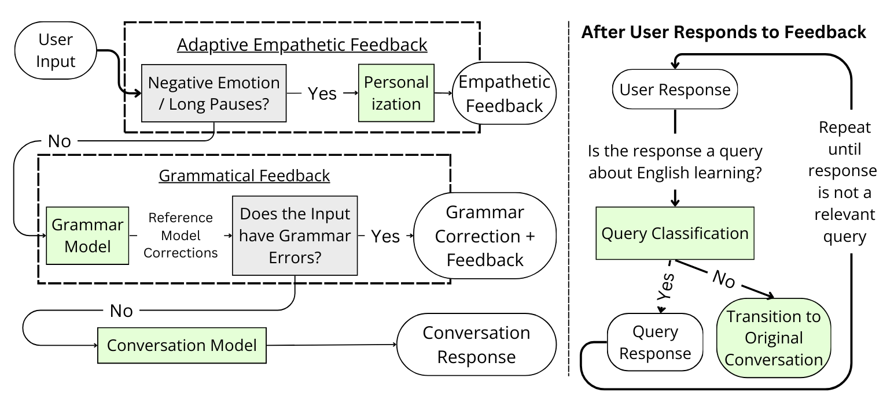

# EDEN: Empathetic Dialogues for English learning

This is the code for our paper **EDEN: Empathetic Dialogues for English learning**.

Our paper improves upon our previous work, [Using Adaptive Empathetic Responses for Teaching English](https://arxiv.org/abs/2404.13764). We detail our specific improvements in the following figure, where our improvements are highlighted in green:



### Repository Structure
Our repository is organized as the following:

1. `eden_api/`: The API for EDEN for you to run on your own GPU server. Since the grammar correction code is proprietary, we do not include the grammar correction component in this repository. Instead, you can check out the `grammar_model` repository for how we trained our grammar model.
2. `local_ui/`: A barebone UI for using EDEN locally! It is a streaming chatbot UI that you can adopt for your own purposes as well!
3. `dialogue_model/`: Code and data for training our LLama-2 conversation model.
4. `grammar_model/`: Data for training our Llama-2 spoken grammar correction model (under construction).
5. `experimental_data/`: Data from our user study. Specifically, we include the informed consent form, as well as the data we used for analyses, for reproduction purposes.


## To Run EDEN Locally
Please refer to `eden_api/` for how to get your EDEN backend spun up on a GPU server; just supply your OpenAI Key!

Check out `local_ui/` for running our minimalistic local user interface; make sure that you update the files with the link to your GPU server so that everything calls each other correctly!

More specifically,
### Setup
1. Replace all the <OPENAI_API_KEY> with your own API keys
2. Create a conda environment with the `.yml` file
3. Create two directories: `audio_cache` and `model_storage`, since they are needed in the server running process
4. Download the `pytorch_model.bin` file from [this huggingface wav2vec2 model](https://huggingface.co/ehcalabres/wav2vec2-lg-xlsr-en-speech-emotion-recognition/tree/main), and place it in the `model_storage` directory

### Run The Server
```shell
python3 app.py --serving_port=<PORT_NUMBER>
```

Make sure to update the URL for the GPU server and the port you are running the Flask application on in the front-end UI code, located under `local_ui/`.

## To Use Our Models
We supply a [spoken grammar correction model](https://huggingface.co/sylviali/llama-2-gpt4-grammar) and a [conversation model tailored for English as a second language learners](https://huggingface.co/sylviali/conversation_llama_esl). To use these models, please refer to their respective directories for usage examples. If you have any questions, please don't hesitate to make an issue!

Thank you for your interest :D 
